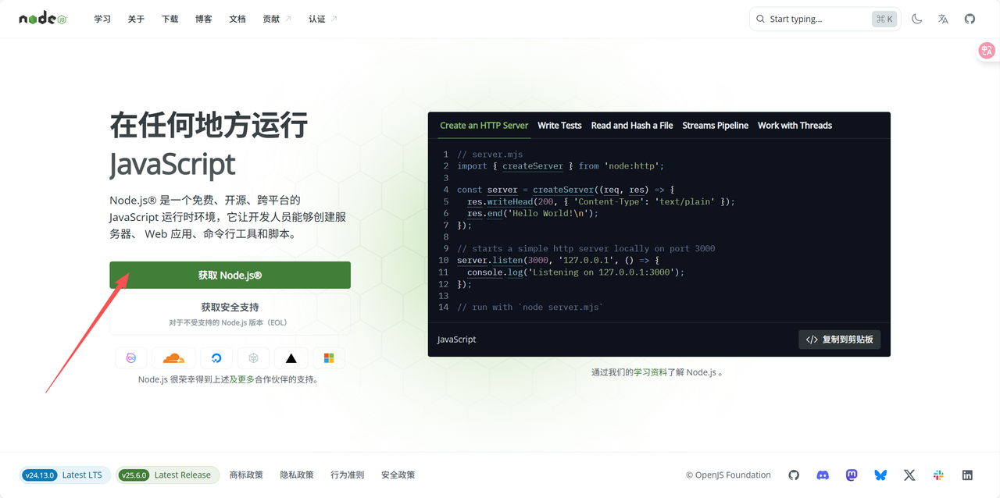
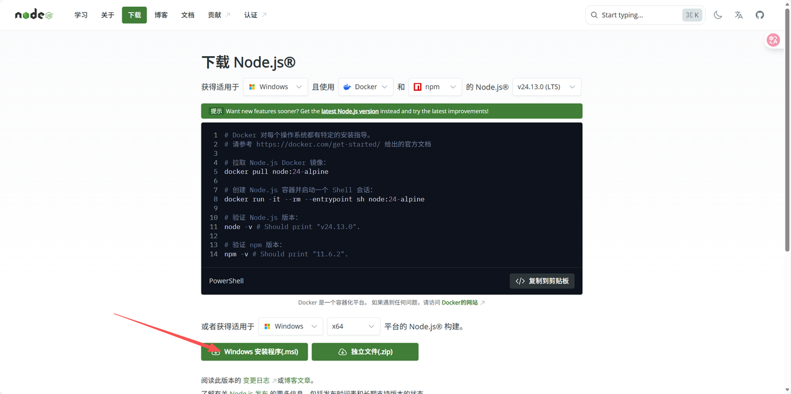
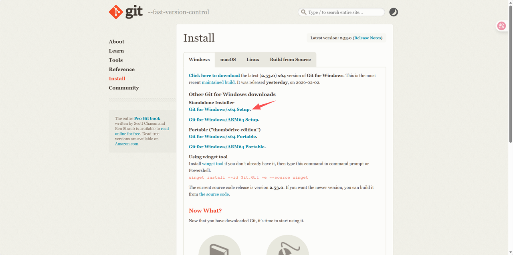
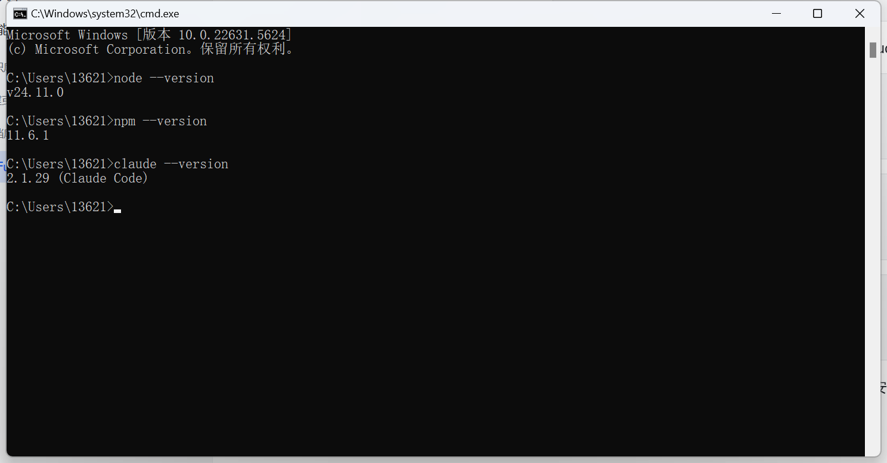
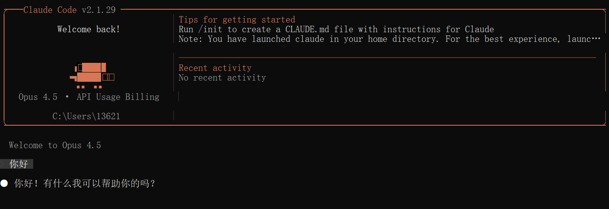
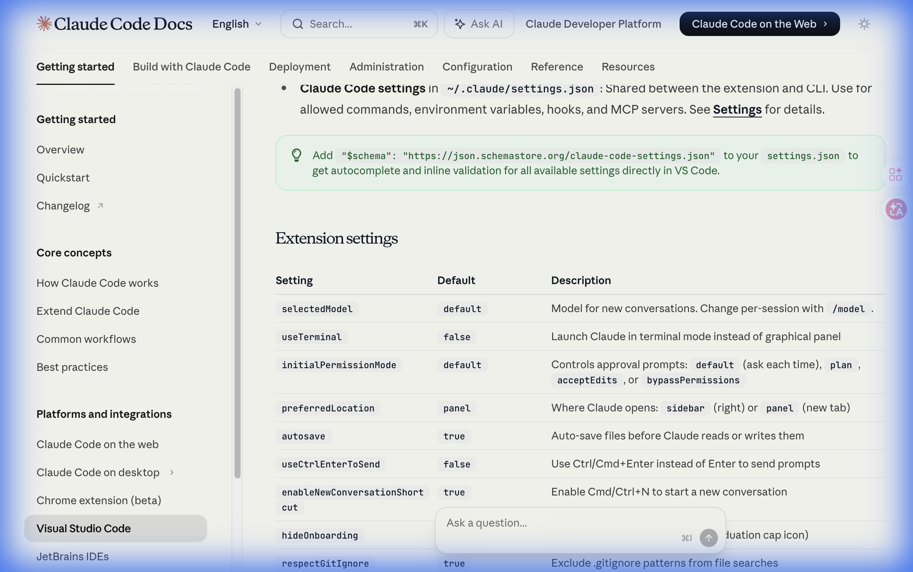
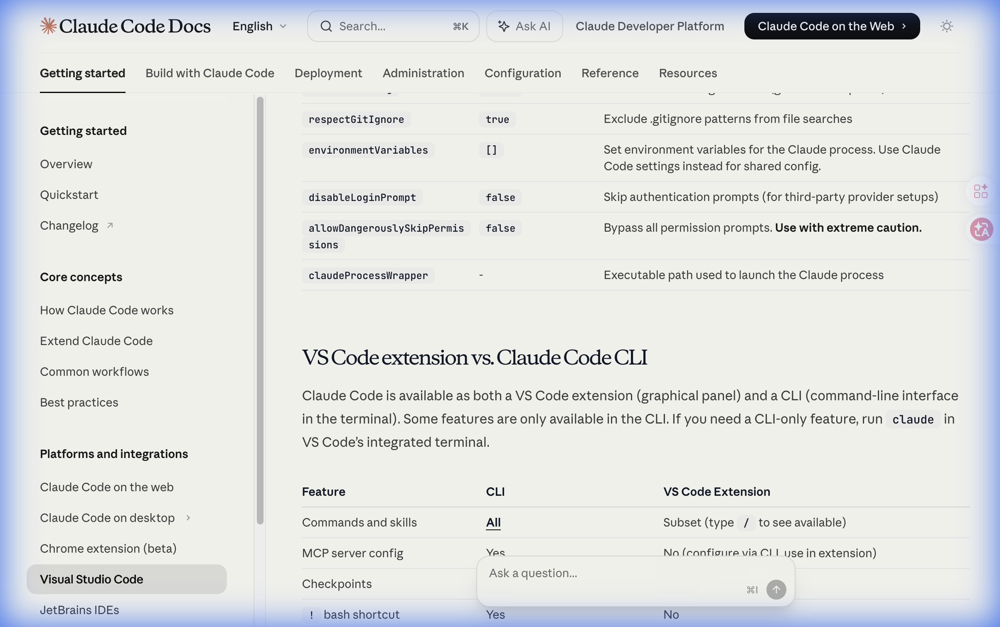

# Claude Code

## 1. Windows 配置

### 1.1 安装 Node.js

点击网址 <https://nodejs.org>





下载好之后安装就行，全部选默认的参数就行。

---

### 1.2 安装 Git

点击网址 <https://git-scm.com/install/windows>



点击对应的安装包，下载完成安装就行。

---

### 1.3 安装 Claude Code

打开 PowerShell 或 CMD，运行以下命令：

```bash
npm install -g @anthropic-ai/claude-code
```

安装完成后，输入以下命令检查 Node.js、Git、Claude Code 是否安装成功：

```bash
node --version
npm --version
claude --version
```

如下图所示，如果显示版本号，恭喜你！Claude Code 已经成功安装了。



---

### 1.3.1 ⚠️ 已知问题：Git Bash 检测报错

> [!WARNING]
> 这是一个 [GitHub 上的已知 bug](https://github.com/anthropics/claude-code/issues)，大量用户反馈即使正确安装了 Git 仍会报错。

**问题现象**：在 VS Code 或 Antigravity 中打开 Claude Code 扩展时，报错：

```
Claude Code on Windows requires git-bash (https://git-scm.com/downloads/win).
If installed but not in PATH, set environment variable pointing to your bash.exe...
```

**根本原因**：扩展内部用 `where.exe git` 命令检测 Git 是否存在。但 VS Code / Antigravity 的进程环境可能缺少 `System32` 或 Git `cmd` 目录的 PATH，导致检测失败。

> [!CAUTION]
> **`CLAUDE_CODE_GIT_BASH_PATH` 环境变量不能解决此问题！** 很多教程建议设置这个变量，但扩展的初始检测函数（`ZD6()`）并不读取此变量，它只执行 `where.exe git`。这个变量是给后续功能使用的，不影响初始检测。

**✅ 解决方案：修补扩展源码**

在 PowerShell 中运行以下命令（一键修补）：

```powershell
# 定位 extension.js 文件
$file = (Get-ChildItem "$env:USERPROFILE\.vscode\extensions\anthropic.claude-code-*\extension.js" -ErrorAction SilentlyContinue) ??
        (Get-ChildItem "$env:USERPROFILE\.antigravity\extensions\anthropic.claude-code-*\extension.js" -ErrorAction SilentlyContinue)

if (-not $file) { Write-Host "ERROR: Claude Code extension not found"; return }

$content = [System.IO.File]::ReadAllText($file.FullName)

# 查找并替换 git-bash 检测逻辑
$pattern = 'catch{throw Error("Claude Code on Windows requires git-bash'
$idx = $content.IndexOf($pattern)

if ($idx -ge 0) {
    # 找到完整的 catch 块并替换
    $catchStart = $idx
    $catchEnd = $content.IndexOf(')")', $idx) + 3
    $oldBlock = $content.Substring($catchStart, $catchEnd - $catchStart)
    $content = $content.Replace($oldBlock, 'catch{return}')
    [System.IO.File]::WriteAllText($file.FullName, $content)
    Write-Host "SUCCESS: Git-bash check bypassed in $($file.FullName)"
} else {
    Write-Host "Already patched or pattern changed in new version"
}
```

> [!IMPORTANT]
> **扩展更新会覆盖补丁！** 建议：
> 1. 在 VS Code / Antigravity 设置中添加 `"extensions.autoUpdate": false` 关闭自动更新
> 2. 保存上面的补丁命令，扩展更新后重新运行即可

---

### 1.4 配置环境变量

> 最好下面两个一起配置

#### 1.4.1 配置 settings.json 文件

> [!IMPORTANT]
> **文件路径**：`C:\Users\<你的用户名>\.claude\settings.json`
>
> 例如用户名为 `Lenovo`，则完整路径为：`C:\Users\Lenovo\.claude\settings.json`
>
> 如果 `.claude` 文件夹或 `settings.json` 不存在，请手动创建。

这个文件是 Claude Code **最核心的配置文件**，控制 API 连接、权限和 MCP 服务器。以下是完整的配置说明。

**API Key 配置（二选一）**

| 方式 | 字段 | 示例值 | 安全性 | 适用场景 |
|------|------|--------|--------|----------|
| **方式一（推荐 ⭐）** | `apiKeyHelper` | `"echo sk-your-key"` | 高（Key 不明文存储） | 团队共享、版本控制 |
| 方式二 | `env.ANTHROPIC_AUTH_TOKEN` | `"sk-your-key"` | 低（明文写死） | 个人快速使用 |

**完整配置示例（含 MCP 服务器）**

```jsonc
{
  // ========================
  // 🔑 API 配置（更换服务商时只改这两行）
  // ========================
  "apiKeyHelper": "echo sk-your-api-key-here",     // ← 改这里：换成新的 API Key
  "env": {
    "ANTHROPIC_BASE_URL": "https://api.kimi.com/coding/",  // ← 改这里：换成新的 API 地址
    "CLAUDE_CODE_GIT_BASH_PATH": "C:\\Program Files\\Git\\bin\\bash.exe"
  },

  // ========================
  // 🔒 权限控制
  // ========================
  "permissions": {
    "allow": [
      "Bash(ffmpeg:*)"    // 允许 Claude 执行 ffmpeg 命令
    ],
    "deny": []
  },

  // ========================
  // 🔌 MCP 服务器（可选，按需添加）
  // ========================
  "mcpServers": {
    "granola": {
      "type": "sse",
      "url": "https://mcp.granola.ai/mcp"
    },
    "v0": {
      "command": "D:\\Program Files\\nodejs\\npx.cmd",
      "args": ["-y", "v0-mcp@latest"],
      "timeout": 60000,
      "env": {
        "V0_API_KEY": "your-v0-api-key-here",
        "PATH": "D:\\Program Files\\nodejs;C:\\Windows\\System32;C:\\Windows"
      }
    },
    "weixin-reader": {
      "command": "C:\\Users\\用户名\\AppData\\Local\\Programs\\Python\\Python312\\python.exe",
      "args": ["D:\\your-project\\wexin-read-mcp\\src\\server.py"],
      "timeout": 30000
    },
    "ChatPRD": {
      "command": "D:\\Program Files\\nodejs\\npx.cmd",
      "args": ["-y", "mcp-remote", "https://app.chatprd.ai/mcp"],
      "timeout": 60000,
      "env": {
        "PATH": "D:\\Program Files\\nodejs;C:\\Windows\\System32;C:\\Windows"
      }
    }
  }
}
```

> [!NOTE]
> 上面 JSON 中的注释仅用于说明，**实际使用时请删除所有 `//` 注释**（JSON 标准不支持注释）。

**字段逐行解释**

| 字段 | 作用 | 何时需要修改 |
|------|------|-------------|
| `apiKeyHelper` | 通过命令返回 API Key | **更换 API 服务商时** |
| `env.ANTHROPIC_BASE_URL` | API 服务商地址 | **更换 API 服务商时** |
| `env.CLAUDE_CODE_GIT_BASH_PATH` | Git Bash 路径 | 仅 Git 安装路径不同时 |
| `permissions.allow` | 允许 Claude 自动执行的命令 | 按需添加 |
| `mcpServers.*` | MCP 服务器配置 | 添加/删除 MCP 服务时 |

> [!TIP]
> **关于 MCP 服务器**：
> - `granola`：会议记录管理，通过 SSE 连接
> - `v0`：Vercel v0 UI 原型生成，需要 [V0 API Key](https://v0.dev)
> - `weixin-reader`：微信公众号文章抓取（Python 实现）
> - `ChatPRD`：AI 产品文档生成
>
> 每个 MCP 服务器的 `env.PATH` 需要手动补全 `nodejs` 和 `System32` 路径，因为 VS Code / Antigravity 的进程 PATH 可能不完整。

---

#### 1.4.2 配置环境变量

`setup_claude_env.bat`：

```bat
@echo off
echo ========================================
echo   Claude Code Environment Setup
echo ========================================
echo.

set /p API_KEY=Please enter your API Key:

if "%API_KEY%"=="" (
    echo Error: API Key cannot be empty!
    pause
    exit /b 1
)

echo.
echo Setting environment variables...

setx ANTHROPIC_AUTH_TOKEN "%API_KEY%"
setx ANTHROPIC_BASE_URL "https://www.fucheers.top"
setx CLAUDE_CODE_MAX_OUTPUT_TOKENS "12000"
setx CLAUDE_CODE_GIT_BASH_PATH "C:\Program Files\Git\bin\bash.exe"

echo.
echo ========================================
echo   Setup Complete!
echo ========================================
echo.
echo Environment variables set:
echo   ANTHROPIC_AUTH_TOKEN = %API_KEY%
echo   ANTHROPIC_BASE_URL = https://www.fucheers.top
echo   CLAUDE_CODE_MAX_OUTPUT_TOKENS = 12000
echo   CLAUDE_CODE_GIT_BASH_PATH = C:\Program Files\Git\bin\bash.exe
echo.
echo Please restart your terminal for changes to take effect.
echo.
pause
```

下载这个 bat 文件，输入 API Key 回车即设置完成。

> **注意**：`CLAUDE_CODE_GIT_BASH_PATH` 主要用于 CLI 版 `claude` 命令。如果 VS Code/Antigravity 扩展仍报错，请参考 [1.3.1 节](#131-️-已知问题git-bash-检测报错) 使用源码补丁方案。

---

### 1.5 跳过首次引导（可选）

在 PowerShell 中运行以下命令，跳过 Claude Code 首次启动时的欢迎界面和引导流程：

```powershell
node --eval "
    const os = require('os');
    const fs = require('fs');
    const path = require('path');
    const filePath = path.join(os.homedir(), '.claude.json');
    const content = fs.existsSync(filePath) ? JSON.parse(fs.readFileSync(filePath, 'utf-8')) : {};
    fs.writeFileSync(filePath, JSON.stringify({ ...content, hasCompletedOnboarding: true }, null, 2));
    console.log('Done: hasCompletedOnboarding set to true');
"
```

> [!TIP]
> 这一步会在 `~/.claude.json` 中写入 `"hasCompletedOnboarding": true`，告诉 Claude Code 已完成引导。配合 `ANTHROPIC_BASE_URL`（第三方 API）和 `disableLoginPrompt`（[§5 VS Code 设置](#关键设置disable-login-prompt)）即可完全跳过 Anthropic 官方 OAuth 登录。

---

### 1.6 打开 Claude Code 终端

打开终端输入 `claude` 回车即可正常使用 Claude。



---

## 2. macOS 配置

### 前置条件

确保已安装 Node.js（版本 >= 18）和 Claude Code CLI。

**安装 Node.js**

```bash
node -v
```

如果显示 `command not found`，需要先安装：

- 访问 <https://nodejs.org> 下载 macOS 安装包
- 双击下载的 `.pkg` 文件，按提示完成安装

**安装 Claude Code CLI**

```bash
npm install -g @anthropic-ai/claude-code
```

下载好了之后验证一下：

```bash
claude --version
```

显示版本号说明下载成功。

---

### 配置环境

> [!TIP]
> 配置其中一个不行，就两个方法一起配置。

#### 方法 1：环境变量设置

编辑 shell 配置文件（根据使用的 shell 选择）：

**如果是 bash（默认）**

```bash
echo 'export ANTHROPIC_BASE_URL="https://www.fucheers.top"' >> ~/.bash_profile
echo 'export ANTHROPIC_AUTH_TOKEN="替换为您的API Key"' >> ~/.bash_profile
source ~/.bash_profile
```

**如果是 zsh**

```bash
echo 'export ANTHROPIC_BASE_URL="https://www.fucheers.top"' >> ~/.zshrc
echo 'export ANTHROPIC_AUTH_TOKEN="替换为您的API Key"' >> ~/.zshrc
source ~/.zshrc
```

#### 方法 2：配置 settings.json

执行以下命令一键创建配置文件：

```bash
mkdir -p ~/.claude
cat > ~/.claude/settings.json << 'EOF'
{
  "env": {
    "ANTHROPIC_AUTH_TOKEN": "替换为您的API Key",
    "ANTHROPIC_BASE_URL": "https://www.fucheers.top"
  },
  "permissions": {
    "allow": [],
    "deny": []
  }
}
EOF
```

#### 跳过首次引导（可选）

```bash
# 在 ~/.claude.json 中标记已完成引导，跳过欢迎界面和登录提示
node -e "
const fs = require('fs');
const path = require('path');
const filePath = path.join(require('os').homedir(), '.claude.json');
const content = fs.existsSync(filePath) ? JSON.parse(fs.readFileSync(filePath, 'utf-8')) : {};
fs.writeFileSync(filePath, JSON.stringify({ ...content, hasCompletedOnboarding: true }, null, 2));
console.log('Done: hasCompletedOnboarding set to true');
"
```

---

### 启动 Claude Code

打开终端输入 `claude` 回车即可。

---

<br/>

> [!NOTE]
> **以上为 PDF 原文教程内容。** 以下为补充资料，包含一键安装脚本、Claude Code 模型配置以及 VS Code 扩展设置说明，可独立参考。

---

## 3. 完整安装脚本

> [!TIP]
> 若已通过上面的教程完成安装，可跳过本节。以下脚本提供一键安装方式，适合快速部署。

### Windows

```powershell
# 打开 Windows 终端中的 PowerShell 终端
# 右键按 Windows 按钮，点击「终端」

# 然后依次执行下面的
winget install --id Git.Git -e --source winget # 或者参考 https://git-scm.com/install/windows 用其他办法安装 Git
winget install OpenJS.NodeJS # 或者参考 https://nodejs.org/zh-cn/download 用其他办法安装 Node.js
Set-ExecutionPolicy -Scope CurrentUser RemoteSigned

# 然后关闭终端窗口，新开一个终端窗口

# 安装 claude-code
npm install -g @anthropic-ai/claude-code --registry=https://registry.npmmirror.com

# 初始化配置（跳过首次引导流程）
node --eval "
    const homeDir = os.homedir();
    const filePath = path.join(homeDir, '.claude.json');
    if (fs.existsSync(filePath)) {
        const content = JSON.parse(fs.readFileSync(filePath, 'utf-8'));
        fs.writeFileSync(filePath, JSON.stringify({ ...content, hasCompletedOnboarding: true }, null, 2), 'utf-8');
    } else {
        fs.writeFileSync(filePath, JSON.stringify({ hasCompletedOnboarding: true }), 'utf-8');
    }"
```

### macOS 与 Linux

```bash
# 安装 fnm（快速 Node.js 版本管理器）
curl -fsSL https://fnm.vercel.app/install | bash

# 新开一个 terminal，让 fnm 生效
fnm install 24.3.0
fnm default 24.3.0
fnm use 24.3.0

# 安装 claude-code
npm install -g @anthropic-ai/claude-code --registry=https://registry.npmmirror.com

# 初始化配置（跳过首次引导流程）
node --eval "
    const homeDir = os.homedir();
    const filePath = path.join(homeDir, '.claude.json');
    if (fs.existsSync(filePath)) {
        const content = JSON.parse(fs.readFileSync(filePath, 'utf-8'));
        fs.writeFileSync(filePath, JSON.stringify({ ...content, hasCompletedOnboarding: true }, null, 2), 'utf-8');
    } else {
        fs.writeFileSync(filePath, JSON.stringify({ hasCompletedOnboarding: true }), 'utf-8');
    }"

# ✅ 安装完成！接下来请跳转到「§4 配置 Claude Code 模型」设置 API Key 和 Base URL
```

> 如果终端提示 `fnm` 命令未找到，请重新打开终端窗口再执行后续命令。

> [!TIP]
> **关于 `hasCompletedOnboarding`**：
>
> 在 `~/.claude.json` 中设置 `"hasCompletedOnboarding": true` 可以**跳过 Claude Code 首次启动的引导流程**（欢迎界面、条款同意、登录提示等）。
>
> 但这**不等于跳过 OAuth 登录**。要完全绕过 Anthropic 官方 OAuth，需要三者配合：
>
> | 配置 | 作用 |
> |------|------|
> | `hasCompletedOnboarding: true`（`~/.claude.json`） | 跳过首次引导流程 |
> | `disableLoginPrompt: true`（VS Code 扩展设置） | 不弹出登录窗口 |
> | `ANTHROPIC_BASE_URL` + `apiKeyHelper`（`~/.claude/settings.json`） | 使用第三方 API Key 认证 |

---

## 4. 配置 Claude Code 模型

完成 Claude Code 安装后，请按照以下方式设置环境变量使用 Claude Code 模型。

### macOS 与 Linux

```bash
export ANTHROPIC_BASE_URL=https://api.kimi.com/coding/
export ANTHROPIC_API_KEY=sk-kimi-xxxxxxxxxxxxxxxxxxxxxxxxxxxxxxxxxxxxxxxxxxxxxxxxxxxxxxxxxxxxxxxx  # 这里填在会员页面生成的 API Key

claude
```

### Windows

```powershell
$env:ANTHROPIC_BASE_URL="https://api.kimi.com/coding/";
$env:ANTHROPIC_API_KEY="sk-kimi-xxxxxxxxxxxxxxxxxxxxxxxxxxxxxxxxxxxxxxxxxxxxxxxxxxxxxxxxxxxxxxxx"  # 这里填在会员页面生成的 API Key

claude
```

### 确认环境变量是否生效

启动 Claude Code 后，在命令输入框输入 `/status`，确认模型状态。

接下来就可以使用 Claude Code 进行开发了！

---

## 5. VS Code 扩展与 Claude Code CLI

> [!TIP]
> 以下内容同样适用于 **Antigravity IDE**（Google 基于 VS Code 的 fork）。两者的区别仅在扩展安装路径：
> - VS Code：`%USERPROFILE%\.vscode\extensions\anthropic.claude-code-*\`
> - Antigravity：`%USERPROFILE%\.antigravity\extensions\anthropic.claude-code-*\`
>
> 设置界面和操作方式完全一致。

### 扩展设置

`~/.claude/settings.json` 中的 Claude Code 设置，在 VS Code 和 CLI 之间共享，用于配置环境变量、hooks 和 MCP servers。有关详细信息，请参阅 [Settings](https://code.claude.com/docs/en/settings)。

> 💡 在 `settings.json` 中添加 `"$schema": "https://json.schemastore.org/claude-code-settings.json"` 可以获得自动补全和内联验证。





| 设置 | 默认值 | 描述 |
|---|---|---|
| `selectedModel` | `default` | 新对话的默认模型，使用 `/model` 按命令切换 |
| `useTerminal` | `false` | 在终端里使用而不是编辑器面板中启动 Claude |
| `initialPermissionMode` | `default` | 初始权限模式：`default`（需要同意）、`plan`、`acceptEdits` 或 `bypassPermissions` |
| `preferredLocation` | `panel` | Claude 打开的位置：`sidebar`（右侧）或 `panel`（新标签页） |
| `autosave` | `true` | 在 Claude 读取或写入文件前自动保存文件 |
| `useCtrlEnterToSend` | `false` | 使用 Ctrl/Cmd+Enter 而不是 Enter 发送提示 |
| `enableNewConversationShortcut` | `true` | 启用 Cmd/Ctrl+N 以开始新对话 |
| `hideOnboarding` | `false` | 隐藏入门引导卡片（生产环境推荐） |
| `respectGitIgnore` | `true` | 从文件搜索中排除 `.gitignore` 匹配项 |
| `environmentVariables` | `{}` | 为 Claude 进程设置环境变量。共享配置请使用 Claude Code 设置 |
| **`disableLoginPrompt`** | **`false`** | **跳过身份验证提示（用于第三方提供商设置）** |
| `allowDangerouslySkipPermissions` | `false` | 跳过所有权限检查请求，**谨慎使用** |
| `claudeProcessWrapper` | `-` | 用于启动 Claude 进程的可执行文件路径 |

> [!CAUTION]
> **`environmentVariables` 必须使用对象格式 `{}`，不能用数组 `[]`！**
>
> 错误写法会导致 `v is not iterable` 报错，使扩展无法启动。
>
> ```json
> // ❌ 错误：使用数组
> "claudeCode.environmentVariables": ["ANTHROPIC_BASE_URL=https://..."]
>
> // ✅ 正确：使用对象
> "claudeCode.environmentVariables": {
>     "ANTHROPIC_BASE_URL": "https://..."
> }
> ```

> [!WARNING]
> **Antigravity IDE 用户注意：** 即使使用了正确的对象格式 `{}`，在 Antigravity 的 IDE 设置中配置 `claudeCode.environmentVariables` 仍可能触发 `V is not iterable` 错误（`TypeError` at `YB` / `hQ` constructor），导致扩展完全无法激活（命令未注册）。
>
> **推荐做法：** 不要在 Antigravity IDE 设置中配置 `environmentVariables`。所有 API 相关配置（`apiKeyHelper`、`ANTHROPIC_BASE_URL`）只需放在 `~/.claude/settings.json` 中即可。

### 关键设置：Disable Login Prompt

> [!IMPORTANT]
> 使用第三方 API（如 Claude Code）时，必须在 VS Code 中勾选此选项，否则扩展会反复弹出 Anthropic 登录提示。

在 VS Code 中搜索 `@ext:Anthropic.claude-code`，找到 **Claude Code: Disable Login Prompt** 选项并勾选：

- **作用**：当设置为 `true` 时，扩展中不再提示登录/认证，适用于认证由外部处理的场景
- **推荐同时勾选**：
  - ✅ Claude Code: **Autosave** — 自动保存文件
  - ✅ Claude Code: **Enable New Conversation Shortcut** — Cmd/Ctrl+N 快捷键

---

### VS Code 扩展 vs. Claude Code CLI

Claude Code 同时提供 VS Code 扩展（图形界面）和 CLI（终端命令行）两种使用方式。部分功能仅在 CLI 中可用。如需使用 CLI 专属功能，可在 VS Code 集成终端中运行 `claude`。

| 功能 | CLI | VS Code 扩展 |
|---|---|---|
| 命令和技能 | [全部](https://code.claude.com/docs/en/interactive-mode#built-in-commands) | 部分（输入 `/` 查看可用命令） |
| MCP 服务器配置 | ✅ | ❌（通过 CLI 配置后在扩展中使用） |
| Checkpoints（检查点） | ❌ | ✅ |
| `!` bash 快捷方式 | ✅ | ❌ |
| Tab 补全 | ✅ | ❌ |
| 自定义 slash 命令 | ✅ | ✅ |

---

## 6. 🔄 更换 API 提供商

当需要更换 API 服务商时（例如从 Kimi 切换到其他兼容 Anthropic API 格式的服务商），**只需修改 1 个文件的 2 个字段**。

### 📁 需要修改的文件

```
C:\Users\<你的用户名>\.claude\settings.json
```

macOS / Linux：

```
~/.claude/settings.json
```

> [!NOTE]
> 如果你是通过**环境变量**（`~/.zshrc`、`~/.bash_profile` 或 Windows 系统环境变量）配置的 API 信息，也需要同步修改对应文件中的 `ANTHROPIC_BASE_URL` 和 `ANTHROPIC_AUTH_TOKEN`（或 `ANTHROPIC_API_KEY`）。

### 🔧 需要修改的字段

| 字段 | 改什么 | 示例 |
|------|--------|------|
| `apiKeyHelper` | `echo` 后面的 API Key | `"echo sk-new-xxx"` |
| `env.ANTHROPIC_BASE_URL` | API 服务商的地址 | `"https://new-provider.com/v1/"` |

### 📝 修改示例（diff 对比）

```diff
 {
-  "apiKeyHelper": "echo sk-kimi-旧的Key",
+  "apiKeyHelper": "echo sk-new-新的Key",
   "env": {
-    "ANTHROPIC_BASE_URL": "https://api.kimi.com/coding/"
+    "ANTHROPIC_BASE_URL": "https://new-provider.com/v1/"
   }
 }
```

> [!WARNING]
> **其他字段不要动！** `permissions`、`mcpServers`、`CLAUDE_CODE_GIT_BASH_PATH` 等字段与 API 服务商无关，改了可能导致功能异常。

### ✅ 完整操作步骤

1. 用任意编辑器打开 `~/.claude/settings.json`
2. 找到 `apiKeyHelper` 行 → 把 `echo` 后面的内容换成新的 API Key
3. 找到 `ANTHROPIC_BASE_URL` 行 → 把 URL 换成新服务商的地址
4. 保存文件
5. **使生效**（二选一）：
   - **VS Code / Antigravity**：按 `Ctrl+Shift+P`（macOS：`Cmd+Shift+P`）→ 输入 `Reload Window` 回车
   - **CLI 终端**：关闭终端窗口，重新打开后运行 `claude`
6. 输入 `/status` 确认已连接到新的服务商 ✅

### 🔍 常见第三方 API 服务商参考

| 服务商 | `ANTHROPIC_BASE_URL` 格式 |
|--------|---------------------------|
| Kimi | `https://api.kimi.com/coding/` |
| Fucheers | `https://www.fucheers.top` |
| 其他兼容服务商 | 参考服务商文档中的 Base URL |

---

## 📎 相关资源

| 资源 | 说明 |
|------|------|
| [🧰 AI 工具箱 · 资源汇总](https://ai-toolkit-collection.pages.dev/) | Claude Code Skills、MCP 服务、开源模型与实用工具 |
| [📅 7天 AI 工具链全栈进化路线](https://7day-roadmap.pages.dev/) | 从 Obsidian 数据库到自媒体 IP 打造的完整学习路线 |
